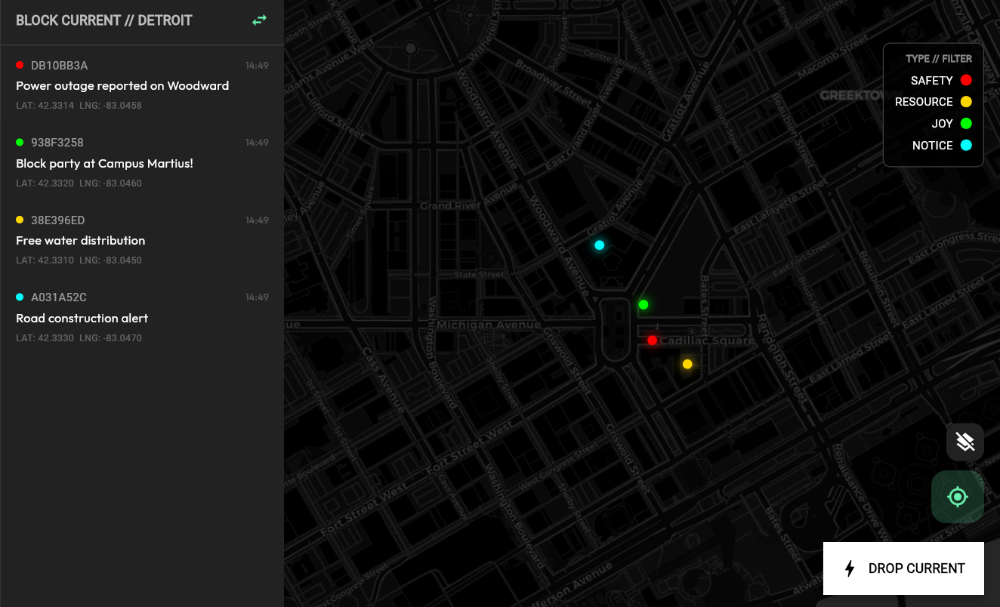

# BLOCK CURRENT

   

**BLOCK CURRENT** is a decentralized, offline-first hyper-local radar for community resource sharing. It operates on a mesh network principle, allowing users to "drop" pulses (safety alerts, resources, joy events) that are broadcast via BLE and synchronized opportunistically to global relays.



## The Philosophy
In a post-control world, connectivity should not be a privilege. BLOCK CURRENT allows communities to coordinate, share food/water locations, and signal safety without relying on central internet providers or corporate datastores.

**"Be the Mule."** Your device bridges the air-gap for others.

## Key Features
- **Offline-First Maps**: Global city navigation without internet.
- **P2P Broadcasting**: BLE advertising transmits pulses to nearby devices (0-100m).
- **Mule Architecture**: Store-and-forward logic uploads offline data when back online.
- **Privacy Core**: Locations are "fuzzed" to ~50m to protect privacy. 7-Day TTL on all data.

## Getting Started

### Prerequisites
- Flutter SDK (3.0+)
- Android SDK (API 30+)

### Building for Android
To install on your physical device:

```bash
flutter pub get
flutter build apk --release
```

The APK will be located at: `build/app/outputs/flutter-apk/app-release.apk`

## Roadmap
- [x] Radar UI & filtering
- [x] Offline Global Geocoder
- [x] Pulse Creation & Fuzzing
- [ ] BLE Mesh Networking (In Progress)
- [ ] Nostr Relay Integration
